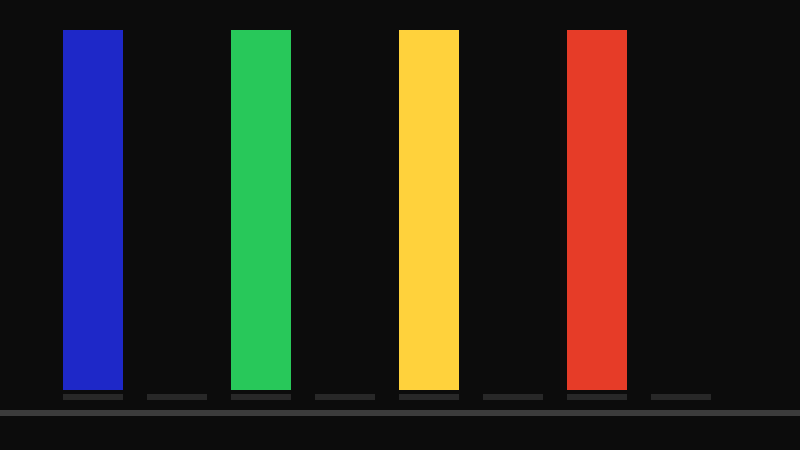
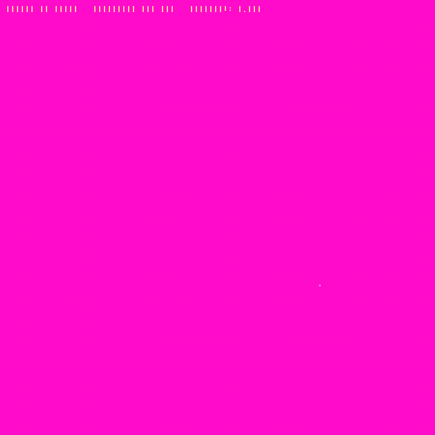

# ⚛️ quantum-cinema

**EN:** Two quantum simulation engines, built from scratch, verified to the decimal, and filmed as GIFs:

1. **Statevector engine** — a 26-qubit gate-model quantum computer simulator. A single register is a **1 GB** complex array; one QFT pass scans **~350 GB** of memory. Grover search over 65k and 1M items, quantum teleportation, Shor factoring 15 — all verified.
2. **Wavefunction engine** — the 2D Schrödinger equation solved by **split-step Fourier** method: the double-slit experiment, quantum tunneling, harmonic-trap breathing — rendered as flowing phase-rainbow and intensity fields.

**TR:** İki kuantum simülasyon motoru, sıfırdan, ondalığına kadar doğrulanmış ve GIF'lerle filmlenmiş:

1. **Statevector motoru** — 26 kübitli kapı-modeli kuantum bilgisayar simülatörü. Tek kayıt **1 GB**'lık complex128 dizisi; bir QFT geçişi **~350 GB** bellek tarar.
2. **Dalga fonksiyonu motoru** — 2B Schrödinger denklemi split-step Fourier yöntemiyle: çift yarık deneyi, kuantum tünelleme, harmonik tuzak soluması — faz-gökkuşağı ve yoğunluk alanları olarak.


> Çift yarık deneyinin her pikseli, Schrödinger denkleminin gerçek bir çözümü — girişim deseni hesaplanıyor, çizilmiyor.

## 🖼️ Gallery / Galeri

### ⚛️ Shor N=15 — QFT periyot bulma

QFT tepelerinden periyot r=4 → **15 = 3 × 5**. Kuantum bilgisayarla çarpanlara ayırma, gerçek periyot-bulma devresiyle. — *QFT tepelerinden periyot r=4 → 15 = 3 × 5.*

### 🔍 Grover 16 ve 20 kübit

65,536 ve 1,048,576 elemanlı aramalar: genlik büyütme iterasyonlarında işaretli durumun olasılığı **%100.00**'e tırmanır — 20 kübitlik koşu 804 iterasyon, 355 saniye kesintisiz evolüsyon. — *İşaretli durumun olasılığı %100'e tırmanır.*

### 🌈 Harmonik Tuzak — faz renk haritası

Faz = renk tonu, |ψ|² = parlaklık: dalga paketi tuzakta dönerken akıcı gökkuşağı alanları. — *Faz renk tonu + parlaklık: tuzakta dönen paket.*

### 🌬️ Tünelleme — [`scenes/tunelleme.json`](scenes/tunelleme.json)

Klasik fizikte imkansız: paketin bir kısmı 120 birimlik bariyerin ÖTESİNE geçiyor. — *Klasik fizikte imkansız: paketin bir kısmı bariyerin ötesine geçiyor.*

### 🌊 Saçılma — [`scenes/sacilma.json`](scenes/sacilma.json)

Merkezî itici potansiyelden moiré girişim deseni. — *Merkezî iticiden moiré girişim deseni.*

## 🧱 The engines / Motorlar

| Motor | Detay |
|---|---|
| ⚛️ Statevector | complex128, 2ⁿ genlik (26 kübit = 1 GB) · kapılar reshape/moveaxis tek geçişte · H X Y Z S T RX RY RZ CX CZ CCX SWAP · QFT · tohumlu ölçüm |
| 🌊 Wavefunction | Split-step Fourier (Strang: V/2-K-V/2) · 512² grid · çift yarık, bariyer, harmonik, merkezî potansiyeller |
| 🔎 Reference | ≤8 kübit yoğun 2ⁿ×2ⁿ matris simülatörü — diferansiyel test referansı |
| 🎞️ Render | Domain coloring (faz=ton, |ψ|²=parlaklık) + yoğunluk paleti · elle 3×5 bitmap font |

## ✅ Verification / Doğrulama — 12 kapı

**EN:** Quantum states can't be eyeballed — every algorithm is checked against independent truth: CNOT truth table vs **dense matrix reference**, teleportation verified branch-by-branch via **reduced density matrices**, Grover against the analytic π/4 ramp, QFT against the textbook DFT matrix, Shor **actually factoring 15**, and for the wave engine: exact norm conservation (10⁻¹⁰), exact free-particle energy conservation, harmonic-trap energy < 1%, and the **double-slit fringe spacing measured against Δy = λL/d**. The gates caught real bugs during development: a Toffoli axis-shift, a mask shape error, a wrong refraction-parallel component.

**TR:** Kuantum durumları gözle denetlenemez — her algoritma bağımsız hakikatle sınanır: CNOT doğruluk tablosu **yoğun matris referansıyla**, teleportasyon **indirgenmiş yoğunluk matrisleriyle** dal dal, Grover π/4 formülüyle, QFT ders kitabı DFT matrisiyle, Shor **gerçekten 15'i çarparak**; dalga motorunda norm korunumu (10⁻¹⁰), serbest parçacıkta tam enerji, harmonik tuzakta <%1 ve **çift yarık çizgi aralığının Δy = λL/d ile ölçülmesi**. Kapılar geliştirme sırasında Toffoli eksen kayması, maske şekil hatası ve kırılma bileşen buglarını yakaladı.

```bash
python3 tests/verify.py   # kubit devreleri: 8 kapı
python3 tests/fizik.py    # dalga motoru: 4 fizik kapisi
python3 render.py hepsi   # gorseller
python3 gorsel.py hepsi   # dalga GIF'leri
```

## 🚀 Usage / Kullanım

```python
# kubit motoru — 1 GB statevector
from quantum import Devre, qft
d = Devre(26)                      # RAM'in nefesini keser
for q in range(26): d.h(q)
qft(d, list(range(26)))            # ~350 GB bellek trafigi

# dalga motoru — Schrodinger
python3 dalga.py --scene scenes/cift_yarik.json
```

## 🧪 Why / Neden

**TR:** Kuantum simülasyonu "çok karmaşık" denerek hazır araçlara bırakılır. Bu proje: kapı mekanığını reshape/moveaxis ile kurgulayan, RAM bütçesini bayt bayt hesaplayan ve iki bağımsız gerçeklemeyle her sonucu kanıtlayan bir motorun ~500 satırda yazılabileceğini gösteriyor. silicon-cinema klasik bilgisayarın beynini döktü; bu repo onun kuantum kardeşi.

## 📄 License

MIT
